## Getting Started Tutorials
### **Simple Viewer Installation **

One of the most common configurations is to create an HTML page in which Mirador takes up the full width and height of the page, with all of the default features activated. There are only a few configuration options that are required to get a fully featured Mirador instance: the [container](https://github.com/IIIF/mirador/wiki/Configuration-Guides#the-container) and the [manifests](https://github.com/IIIF/mirador/wiki/Configuration-Guides#manifests) to load into Mirador.

#### The Container

To initialize Mirador, it needs to be attached to an existing HTML **div** through that element's **id**. You also need to explicitly set that element's width and height. In this example, we are using the full width and height of the page.

```` html
<!DOCTYPE html>
<html lang="en">
  <head>
    <title>Simple Viewer</title>
    <meta charset="UTF-8">
    <meta name="viewport" content="width=device-width, initial-scale=1.0">
    <style>
      #viewer {
        width: 100%;
        height: 100%;
        position: fixed;
      }
    </style>
    <link rel="stylesheet" type="text/css" href="build/mirador/css/mirador-combined.css">
    <script src="build/mirador/mirador.min.js"></script>
  </head>
  <body>
    <div id="viewer"></div>
    <script type="text/javascript">
      $(function() {
        Mirador({
          id: "viewer",
          data: [/* Manifests and collections here */]
        });
      });
    </script>
  </body>
</html>
````

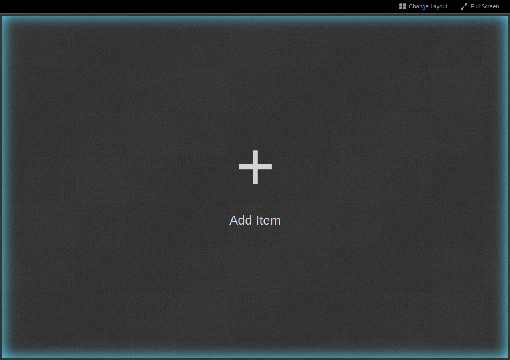


Changing the height and width of Mirador's root element allows you to place it in an HTML page with other content.

#### Manifests and Collections

There are several different ways to add content to your Mirador instance.

The first way is to pass an object into the data array that identifies the desired manifest URI:

```` javascript
Mirador({
  id: "viewer",
  data: [
    { manifestUri: "http://iiif/id/and/uri/of/your/manifest.json", location: "My Repository" }
  ]
});
````

Second, you can pass in an object pointing to a collection URI, which contains a list of manifests that Mirador will parse:

```` javascript
Mirador({
  id: "viewer",
  data: [{
  "collectionUri":
  "http://iiif/id/and/uri/of/your/collection.json"
}
]);
````

The current version of Mirador supports collections of any nesting depth. Collections are displayed on the content tree as folder entries, which can be clicked on to display manifests filed under them. Sub-collections can also be accessed by clicking on the drop-down caret (if available).

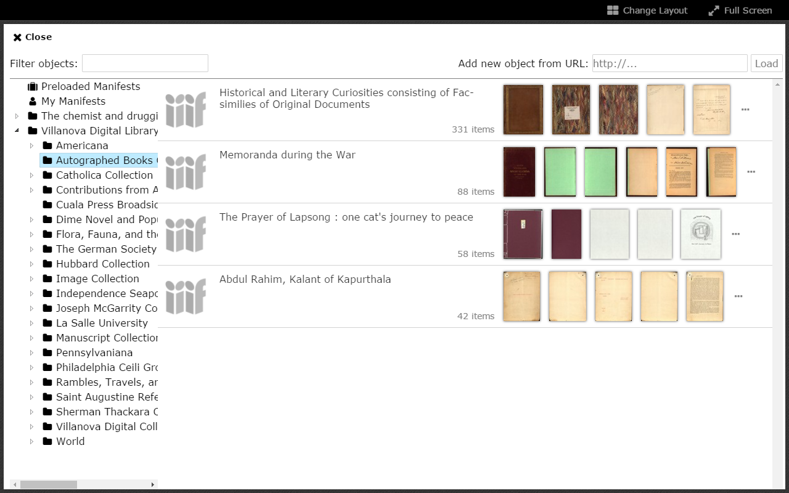

Within the application itself, there are two other ways for end users to add manifests to Mirador:

1. If showAddFromURLBox has not been disabled, an end user can add a known IIIF manifest or collection URL through the Add new object from URL box:

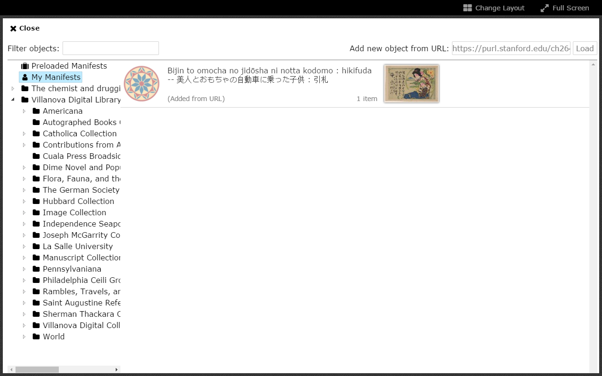

2. Mirador can handle an end user dropping a IIIF manifest into a window using [IIIF Drag-and-drop](http://zimeon.github.io/iiif-dragndrop/):

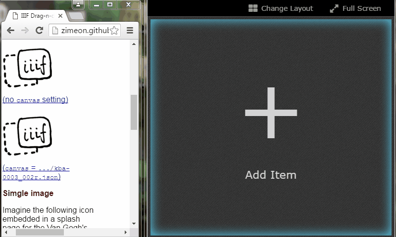

Specifying Which Manifest Will Open

By default, Mirador is configured to open with a single window. You can specify which manifest will be open in that window by using the windowObjects key. The windowObjects key expects an array of objects. Within the object you can name the manifest that will be opened with loadedManifest and even specify which canvas the viewer will focus on with canvasID. The default view is the ImageView viewType. If you want the viewer to open with a different view, you need specify this with "viewType" (e.g., "ThumbnailsView"). Other options that can be added to windowObjects can be found in the [Complete Configuration API](https://github.com/IIIF/mirador/wiki/Complete-Configuration-API#loaded-objects).

```` javascript
Mirador({  id: "viewer",
  data: [{
  manifestUri: "http://iiif/id/and/uri/of/your/manifest.json",
  location: "My Repository"
  }],  
  windowObjects: [{
  loadedManifest: "http://iiif/id/and/uri/of/your/manifest.json",
  canvasID: "http://iiif/id/and/uri/of/your/canvas/canvas-id",
  viewType: "ImageView"
  }]
  });
````

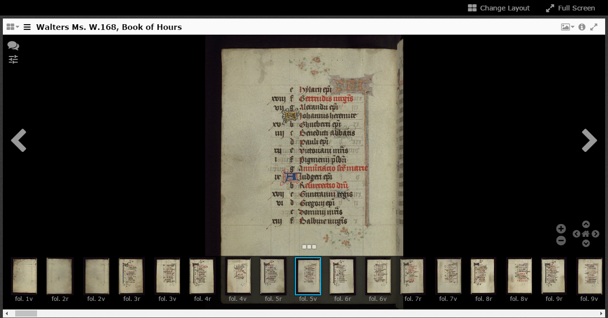

#### View Type

There are four possible viewTypes in the current version of Mirador: ImageView (displayed above), BookView, ThumbnailsView, and ScrollView.  

##### BookView

Like the [previous ](https://github.com/IIIF/mirador/wiki/Configuration-Guides#specifying-which-manifest-will-open)viewType, this configuration provides a minimal, zooming reader, similar to the Internet Archive Bookreader. The instance is configured to show a specific book of the developer's choosing, displayed in a 2-page spread.

```` javascript
Mirador({
id: "viewer",
  data: [{
  manifestUri: "http://iiif/id/and/uri/of/your/manifest.json",
  location: "My Repository"
  }],
  windowObjects: [{
  loadedManifest: "http://iiif/id/and/uri/of/your/manifest.json",
  canvasID: "http://iiif/id/and/uri/of/your/canvas/canvas-id",
  viewType: "BookView"
  }]
});
````

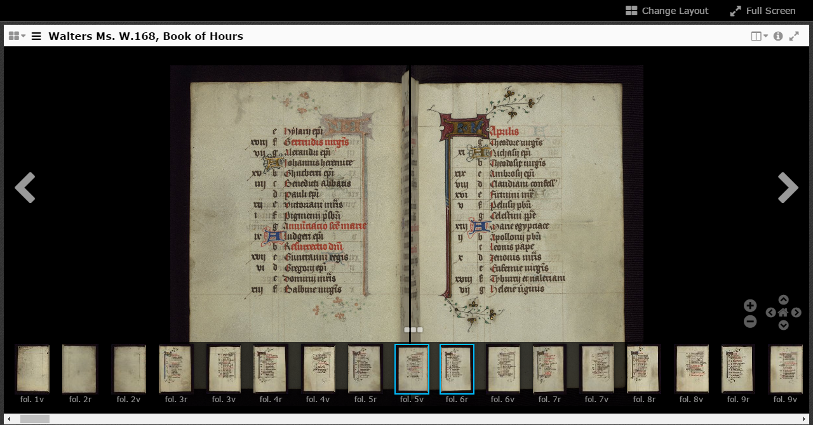

##### ThumbnailsView

The ThumbnailsView viewType configuration displays thumbnail images of all of the pages of the designated book laid out in a grid pattern, from which the user can select and click on a page to view more closely. Unlike the previous viewTypes, the images in ThumbnailsView are not zoomable.


##### ScrollView

Like the previous viewType, ScrollView displays thumbnail images of the designated book, this time in a side-scrolling format, for the user to select from for closer viewing. As with ThumbnailsView, ScrollView does not display zoomable images.

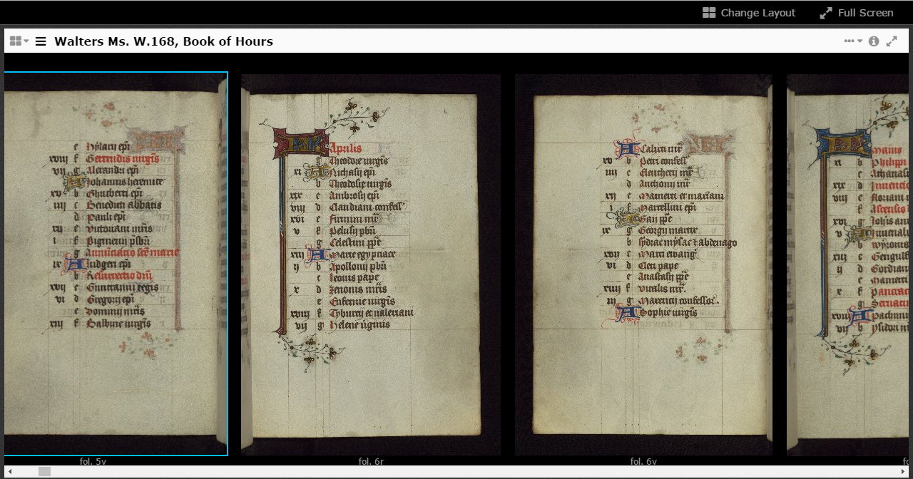

#### Describing Layouts

By default, Mirador opens with a single viewing window. However, it is possible to configure Mirador to open up with any number of windows, positioned in a grid, using the layout option. If you want to specify which window a specific manifest loads into, use slotAddress in windowObjects. Otherwise, Mirador, will arbitrarily load objects into windows based on a first-come, first-served basis. To create an instance of Mirador that opens two windows side by side and places a manifest in each window use this:

```` javascript
Mirador({
id: "viewer",
layout: "1x2",
data: [{
manifestUri: "http://iiif.lib.harvard.edu/manifests/drs:5981093",
location: "Harvard University"
},
{
manifestUri: "http://iiif.biblissima.fr/manifests/ark:/12148/btv1b84539771/manifest.json",
location: "BnF"
}],
windowObjects: [{
loadedManifest: "http://iiif.lib.harvard.edu/manifests/drs:5981093",
slotAddress: "row1.column1",
viewType: "ImageView"
},
{
loadedManifest: "http://iiif.biblissima.fr/manifests/ark:/12148/btv1b84539771/manifest.json",
slotAddress: "row1.column2",
viewType: "ImageView"
}]
);
````

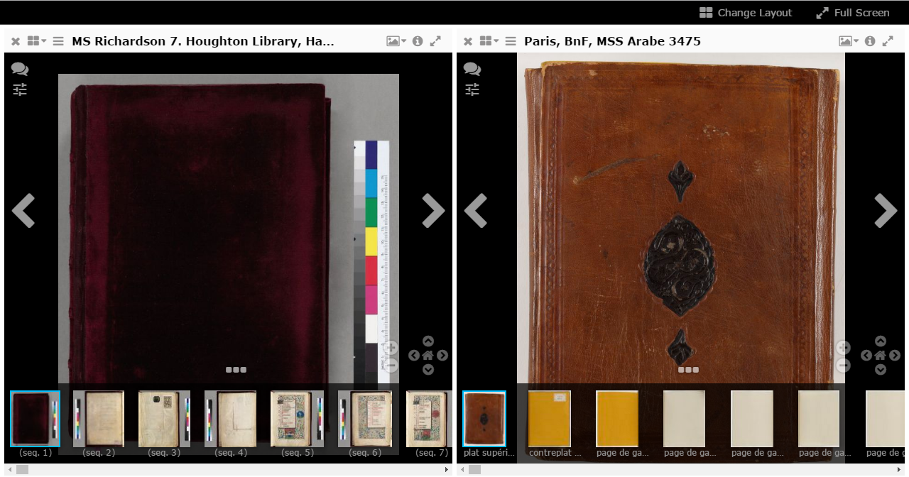

It is also possible to have non-grid layouts in Mirador. You can create these custom layouts using a drop down menu in Mirador:

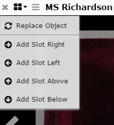


### Configuring Mirador Path

By default, Mirador looks for its associated images, translations and other associated files at the relative path ./build/mirador. If you wish to serve Mirador from another location, you can change this by setting the buildPath option:

```` javascript
Mirador({
  id: "viewer",
  buildPath: "http://cdn.yoursite.com/mirador",
  data: [{
  manifestUri: "http://iiif/id/and/uri/of/your/manifest.json",
  location: "My Repository"
  }]
});
````

## **Zen Mode**

A barebones version of the viewer can be created by turning off the top menu bar, the sidebar, and the bottom thumbnails bar. Doing so prevents the user from opening other objects, spawning more workspace slots or windows, and closing the current window.


The configuration and initialisation for this mode looks like this:

```` javascript
Mirador({
  id: "viewer",
  buildPath: "",
  data: [{
  manifestUri: "http://iiif/id/and/uri/of/your/manifest.json",
    location: "My Repository"
    }
    // For a working example, try:
    // { manifestUri: "http://dms-data.stanford.edu/data/manifests/Walters/qm670kv1873/manifest.json", location: "Stanford University" }
  ],
  mainMenuSettings: {
    show: false
  }
  windowObjects: [{
    loadedManifest: "http://same/iiif/id/as/above/to/your/manifest.json",
    canvasID: "http://iiif/id/and/uri/of/your/canvas/canvas-id",
    // For a working example, try:
    // loadedManifest: "http://dms-data.stanford.edu/data/manifests/Walters/qm670kv1873/manifest.json",
    // canvasID: "http://dms-data.stanford.edu/data/manifests/Walters/qm670kv1873/canvas/canvas-8",
    viewType: "ImageView",
    displayLayout: false,
    bottomPanel: false,
    bottomPanelAvailable: false,
    bottomPanelVisible: false,
    sidePanel: false,
    annotationLayer: false
  }]
});
````

## Embedding

### Iframe

To embed a Mirador instance in an iframe, create a [full-screen](https://github.com/IIIF/mirador/wiki/Configuration-Guides#full-screen-with-all-options) instance with any configuration options you need. Your iframe element will look something like this:

```` html
<iframe title="Mirador" src="*URL to Mirador instance*" allowfullscreen="true" webkitallowfullscreen="true" mozallowfullscreen="true"></iframe>
````

You can change the size and style of the iframe as you need to, and Mirador will exist within its bounds. Adding the allowfullscreen attributes allows the fullscreen option in Mirador to work. If you choose to disable this in Mirador, you do not need to have these attributes in your iframe.

With the current version of Mirador, you can embed any number of viewers this way.


### Inside a div on same web page

You can also embed Mirador inside a div. To do this, embed both the mirador-combined.css and mirador.js, the fixed-size div and the call to Mirador() as you would do with a full-screen setup. If you have set a CSS margin attribute in your main body tag, you need to add !important to it to prevent the mirador-combined.css from overriding it.

With the current version of Mirador, you can only embed one viewer this way. If you want to embed multiple viewers you must use iframes.

```` html
<!DOCTYPE html>
<html lang="en">
<head>
  <title>Embedding in a div</title>
  <style type="text/css">
    html {
      background-color: #999;
    }
    body {
      background-color: #fff;
      padding: 1em 0;
      margin: 0 5% !important;
      width: 90%;
    }
    #viewer {
      display: block;
      width: 90%;
      height: 600px;
      margin: 1em 5%;
      position: relative;
    }
    h1, h2 {
      text-align: center;
    }
  </style>
  <link rel="stylesheet" type="text/css" href="build/mirador/css/mirador-combined.css">
  <script src="build/mirador/mirador.min.js"></script>
</head>
<body>
  <h1>Embedded Default Viewer</h1>
  <h2>The following viewer has been added using default settings.</h2>
  <div id="viewer" allowfullscreen="allowfullscreen"></div>
  <script type="text/javascript">
    $(function() {
      Mirador({
        id: "viewer",
        data: [/* … */]
      });
    });
  </script>
</body>
</html>
````

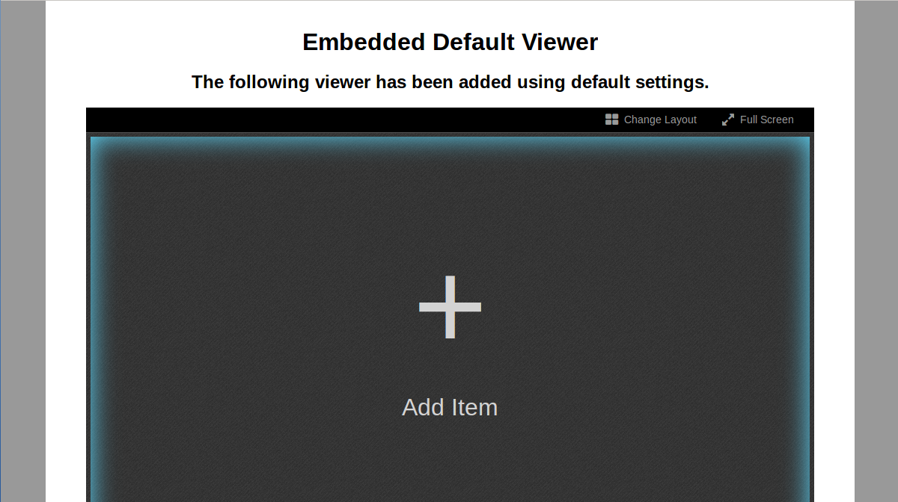

### Annotation Saving (Creating an endpoint adaptor)

To build an endpoint adaptor, you can start with the template provided in js/src/annotations/endpoint.js. All endpoint adaptors must implement the following functions:

<table>
  <tr>
    <td>Function</td>
    <td>Description</td>
    <td>Parameters</td>
    <td>Success</td>
    <td>Fail</td>
  </tr>
  <tr>
    <td></td>
    <td></td>
    <td></td>
    <td></td>
    <td></td>
  </tr>
  <tr>
    <td>Search</td>
    <td>Search for annotations that satisfy the parameters specified in options</td>
    <td>options
successCallbackerrorCallback</td>
    <td>successCallback</td>
    <td>errorCallback</td>
  </tr>
  <tr>
    <td>Delete</td>
    <td>Delete the annotation with the given annotation ID</td>
    <td>annotationID
successCallback
errorCallback</td>
    <td>successCallback</td>
    <td>errorCallback</td>
  </tr>
  <tr>
    <td>Update</td>
    <td>Submit the annotation as an edit</td>
    <td>oaAnnotation
successCallback
errorCallback</td>
    <td>successCallback</td>
    <td>errorCallback</td>
  </tr>
  <tr>
    <td>Create</td>
    <td>Submit the annotation as a new annotation</td>
    <td>oaAnnotation
successCallback
errorCallback</td>
    <td>successCallback</td>
    <td>errorCallback</td>
  </tr>
</table>


Before calling JSON.stringify() on an annotationsList entry, remember to delete its endpoint key to avoid a circular reference to the endpoint. Afterwards, remember to add it back.

#### Example implementation with local storage

##### Search

For simplicity, assume that you don't need additional parameters beyond the URI of the canvas to request.

```` javascript
search: function(options, successCallback, errorCallback) {
  var _this = this;
  this.annotationsList = []; //clear out current list
  try {

    //Load the list of annotations under the canvas URI from local storage (if entry exists)
    var data = localStorage.getItem(options.uri);
    if (data) {
    	 _this.annotationsList = JSON.parse(data);
    }

    //Attach a reference to this endpoint to each entry
    //Don't forget to do this or the annotation won't respond
    jQuery.each(_this.annotationsList, function(index, value) {
      value.endpoint = _this;
    });

    // Done
    // Run the callback if specified, otherwise resolve the endpoint's data state
    if (typeof successCallback === "function") {
      successCallback(_this.annotationsList);
    }
    else {
      _this.dfd.resolve(true);
    }
  }

  // Catching errors
  // Run the callback if specified, otherwise perform some default action or show an error log
  catch (e) {
    if (typeof errorCallback === "function") {
      errorCallback();
    }
    else {
      console.log("There was an error searching this endpoint");
    }
  }
}
````

##### Delete

Search for the deleted ID from the annotation list for the current canvas, remove its entry from the annotation list and overwrite the storage's copy of the annotation list with it.

```` javascript
deleteAnnotation: function(annotationID, successCallback, errorCallback) {
  var _this = this,
  key = _this.annotationsList[0].on.full; //Find current canvas URI from loaded annotation list

  try {
    // Create a new annotation list without the deleted ID
    _this.annotationsList = jQuery.grep(_this.annotationsList, function(value, index) {
      return value['@id'] !== annotationID;
    });

    // Remove endpoint reference before JSON.stringify
    // IMPORTANT: Failure to do this would result in a circular reference error!
    jQuery.each(_this.annotationsList, function(index, value) {
      delete value.endpoint;
    });

    // Rewrite the local storage annotation list with updated version
    localStorage.setItem(key, JSON.stringify(_this.annotationsList));

    // Add back endpoint reference after JSON.stringify
    jQuery.each(_this.annotationsList, function(index, value) {
      value.endpoint = _this;
    });

    // Run success callback if specified
    if (typeof successCallback === "function") {
      successCallback();
    }
  }

  // Unsuccessful, run error callback if specified
  catch (e) {
    if (typeof errorCallback === "function") {
      errorCallback();
    }
  }
}
````

##### Update

From the given Open Annotation item, find its ID and canvas ID, then replace the corresponding entry in the annotation list with the same ID. Once done, overwrite the storage's copy of the annotation list.


```` javascript
update: function(oaAnnotation, successCallback, errorCallback) {
  var _this = this,

  // Find canvas ID and annotation ID
  key = oaAnnotation.on.full,
  annotationID = oaAnnotation['@id'];

  try {
    // If annotation list isn't loaded, reload
    if (_this.annotationsList.length === 0) {
      _this.annotationsList = _this.getAnnotationList(key);
    }

    // Find the matching annotation in the array and update it
    jQuery.each(_this.annotationsList, function(index, value) {
      if (value['@id'] === annotationID) {
        _this.annotationsList[index] = oaAnnotation;
        return false;
      }
    });

    // Remove endpoint reference before JSON.stringify
    jQuery.each(_this.annotationsList, function(index, value) {
      delete value.endpoint;
    });

    // Overwrite storage with updated annotation list
    localStorage.setItem(key, JSON.stringify(_this.annotationsList));

    // Add back endpoint reference after JSON.stringify
    jQuery.each(_this.annotationsList, function(index, value) {
      value.endpoint = _this;
    });

    // Done, run success callback if specified
    if (typeof successCallback === "function") {
      successCallback(oaAnnotation);
    }
  }

  // Failed, run error callback if specified
  catch (e) {
    if (typeof errorCallback === "function") {
      errorCallback();
    }
  }

}
````

##### Create

From the given Open Annotation item, find its canvas ID, then add it to the annotation list under that canvas. Once done, overwrite the storage's copy of the annotation list and return the newly inserted annotation in Open Annotation form.

```` javascript
create: function(oaAnnotation, successCallback, errorCallback) {
  var _this = this,

  // Find the canvas to annotate on
  key = oaAnnotation.on.full;

  try {
    // Reload the annotation list if empty
    if (_this.annotationsList.length === 0) {
      _this.annotationsList = _this.getAnnotationList(key);
    }

    // Generate a new annotation ID and insert into annotation list
    oaAnnotation["@id"] = key + '/' + Date.now();
    _this.annotationsList.push(oaAnnotation);

    // Remove endpoint reference before JSON.stringify
    jQuery.each(_this.annotationsList, function(index, value) {
      delete value.endpoint;
    });

    // Overwrite the local storage with updated annotation list
    localStorage.setItem(key, JSON.stringify(_this.annotationsList));

    // Add endpoint reference after JSON.stringify
    jQuery.each(_this.annotationsList, function(index, value) {
      value.endpoint = _this;
    });

    // Done, run success callback if specified
    if (typeof successCallback === "function") {
      successCallback(oaAnnotation);
    }
  }

  // Failed, run error callback if specified

  catch (e) {
    if (typeof errorCallback === "function") {
      errorCallback();
    }
  }
}
````

##### Using remote state endpoint

To begin using your new remote state endpoint, add the key annotationStorageEndpoint to your setup, and enable annotationLayer and annotationCreation under windowObjects:

```` javascript
$(function() {
  Mirador({
    id: "viewer",
    data: [/* Manifests and collections here *],
    annotationEndpoint: {
   	name: 'Local Storage Endpoint',
   	module: 'LocalStorageEndpoint',
   	options: { /* Options here */ }
    },
    windowObjects: [{
      annotationLayer: true,
   	annotationCreation: true,
   	annotationState: 'annoOncreateOn'
    }]
  });
});
````

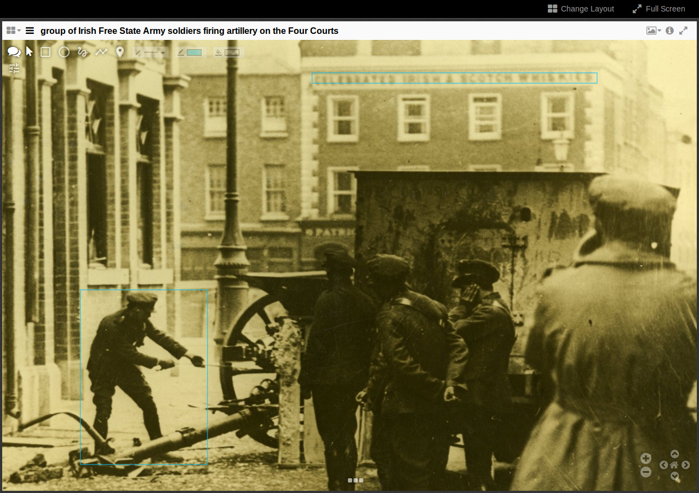

For more example implementations involving annotation servers, see the following built-in endpoint adaptors:

* js/src/annotations/catchEndpoint.js (CATCH)

* js/src/annotations/simpleASEndpoint.js (Simple Annotation Server)

### Remote State Saving

To integrate with your own state storage for bookmarking and viewer state sharing, start with the following template (see Implementor comments below):

```` javascript
(function($) {

  // IMPLEMENTOR: Rename RemoteStateEndpoint
  $.RemoteStateEndpoint = function(opts) {
    this.options = {
      /* IMPLEMENTOR: Set up parameter defaults here (e.g. URLs, user credentials, etc.) */
    };
    jQuery.extend(this.options, opts);
  };

  // IMPLEMENTOR: Rename RemoteStateEndpoint

  $.RemoteStateEndpoint.prototype = {
    readSync: function(blobID) {
      /* IMPLEMENTOR: Return the JSON object referenced by <blobID> here */
    },
    save: function(blob) {
      var deferred = jQuery.Deferred(),
      /* IMPLEMENTOR: Save the given JSON object <blob> and return a jQuery deferred promise that will resolve to the blob ID identifying it. */
    }

  };

}(Mirador));
````

This can be added as an additional .js file in js/src/utils, or embedded on the page where Mirador is being run.

All remote state endpoints must implement the following functions:

* readSync(blobId): Return the JSON object stored under the specified blob ID.

* save(blob): Save the given JSON object blob and return a jQuery deferred promise that resolves to the blob ID identifying it.

##### Example implementation with local storage

Default options: For this example, the integrator should have a choice between local storage or session storage, and an optional prefix before each entry.

```` javascript
$.MyLocalStateEndpoint = function(opts) {
  this.options = {
    storage: window.localStorage,
    prefix: ""
  };
  jQuery.extend(this.options, opts);
};
````

##### readSync: Read from the specified storage

```` javascript
readSync: function(blobId) {

  return JSON.parse(this.options.storage.getItem(blobId));

}

##### save: Save to the specified storage under the current time

```` javascript
save: function(blob) {

  var deferred = jQuery.Deferred(),
      date = new Date,
      _date = date.getFullYear() + "-" + date.getMonth() + "-" + date.getDay() + "-" + date.getHours() + "-" + date.getMinutes() + "-" + date.getSeconds();

  this.options.storage.setItem(this.options.prefix + _date, JSON.stringify(blob));
  deferred.resolve(this.options.prefix + _date);

  return deferred.promise();
}
````

To begin using your new remote state endpoint, add the key jsonStorageEndpoint to your setup, and enable saveSession and mainMenuSettings.buttons.bookmark:

```` javascript
$(function() {
  Mirador({
    id: "viewer",
    data: [/* Manifests and collections here */],
    mainMenuSettings: {
      buttons: {
        bookmark: true
      }
    },
    jsonStorageEndpoint: {
      name: "My local time state endpoint",
      module: "MyLocalStateEndpoint",
      options: { /* Set parameters here in key-value form */ }
    },
    saveSession: true
  });
});
````

